# Yemo's Storyline - A Blog site.

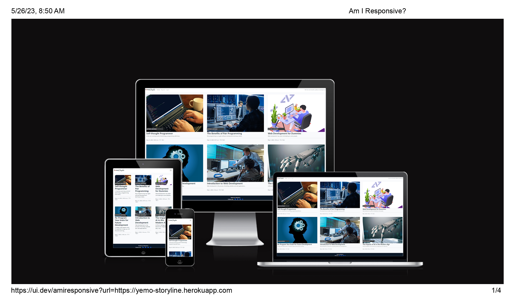

[Click here to view the live project.](https://yemo-storyline.herokuapp.com/)

This is a blog site.

## Table of Contents

- [Yemo's Storyline - A Blog site.](#yemos-storyline---a-blog-site)
  - [Table of Contents](#table-of-contents)
- [Introduction](#introduction)
- [UX](#ux)
- [Layout](#layout)
- [Features](#features)
- [Technologies Used](#technologies-used)
    - [Languages Used](#languages-used)
    - [Frameworks, Libraries and Programs Utilized](#frameworks-libraries-and-programs-utilized)
- [Testing](#testing)
- [Deployment](#deployment)
    - [Heroku](#heroku)
  - [Initial Deployment](#initial-deployment)
- [Credits](#credits)
    - [Code](#code)
    - [Post Contents and Images](#post-contents-and-images)
    - [Acknowledgements](#acknowledgements)

# Introduction

Yemos Storyline is a dynamic news blog website that offers an engaging user experience. By utilizing Google Authentication (OAuth 2.0) as the sole login method, users can securely access the site's features. Once logged in, users have the ability to upvote or downvote posts and actively participate by commenting on articles.

Additionally, site administrators possess exclusive privileges, including the ability to publish blog/news posts and approve or disapprove user comments. With a focus on accessibility, Yemos Storyline is designed to seamlessly adapt to various devices, ensuring a fully responsive experience on desktops, laptops, tablets, and mobile devices.

# UX

- ### User stories

- #### New User's Goals

  - As a new user, my goal is to actively engage with the news site by reading, and commenting on news stories.
  - As a first-time user, I prioritize the security of my account-related information and would like the option to sign out at the end of each session.
  - As a newcomer to the site, I expect a user-friendly experience that allows me to easily navigate and find the content I'm interested in.

- #### Returning and Frequent User's Goals

  - As a returning user, my priority is to quickly and securely sign into my user account for seamless access.
  - As a frequent user of the platform, I value the ability to engage with the content by liking and commenting on posts.
  - As a returning and security-conscious user, I make it a point to sign out of my account at the end of each session to ensure the safety of my personal information.

- #### Site Administrator Goals

  - As a Site Administrator, I require comprehensive control over the website, including the ability to publish blogs/news, manage user data, review and moderate comments, oversee site functionality, edit content, and have the authority to remove or delete user accounts when necessary.

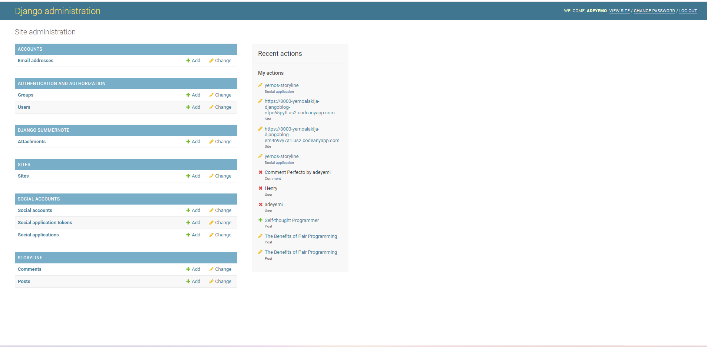
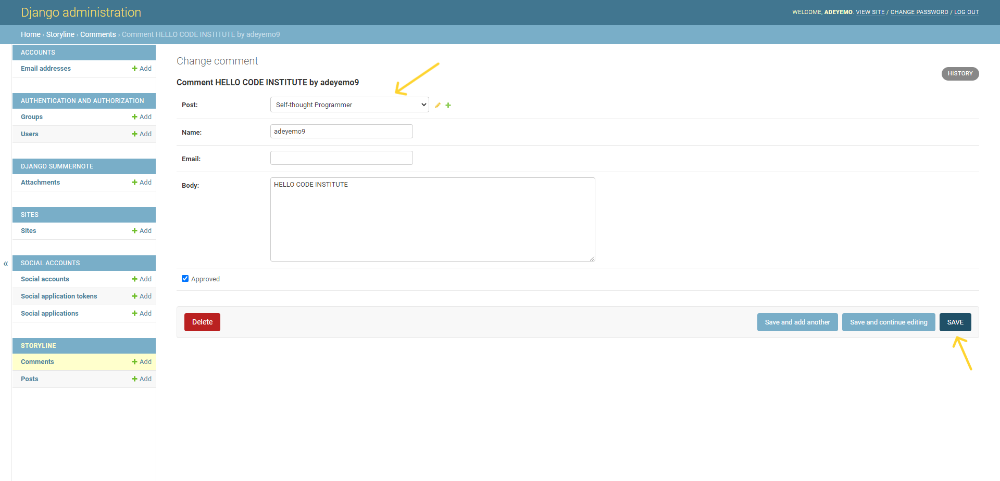
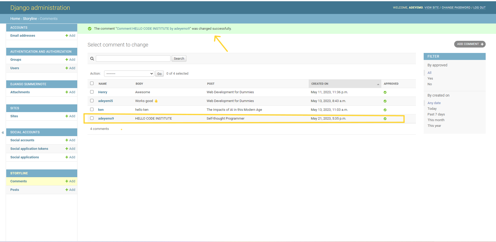

# Layout

- ### Design

  The Home Page has links six (6) interactive blogs on display. Users must first register and then subsequently can sign-in and out with email.

  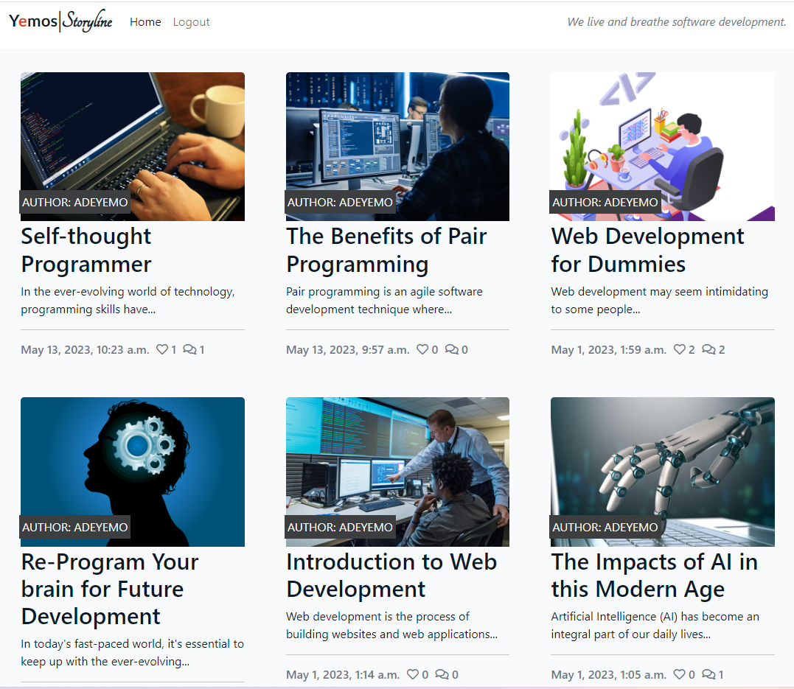

- #### Colour Scheme

  - The website theme incorporates a clean and modern color scheme. The primary colors used for the header, background, footer, and text labels are white and #0A1828. Additionally, a dynamic red color is applied when hovering over blog/news links, adding an interactive element to the design.
    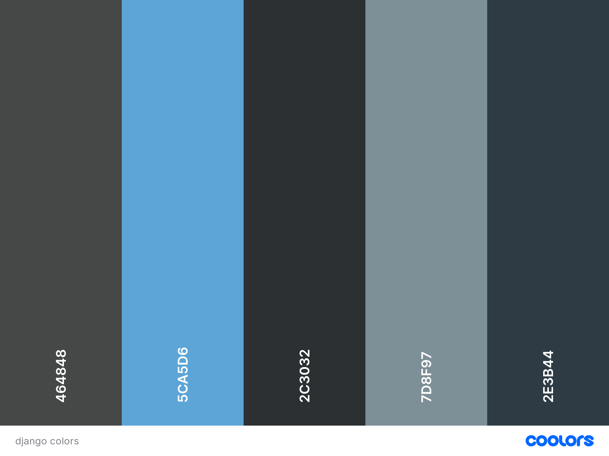

- #### Typography

  - The website utilizes a standardized Bootstrap theme, providing a cohesive and consistent look and feel. The font choices contribute to the overall aesthetic, with "Lato" used for the Yemos brand name, "Tangerine" for the Storyline logo, and "Segoe" selected for labels, titles, and body text. These font selections ensure readability and visual appeal across the website.

- #### Imagery

  - Carefully curated imagery enhances the overall user experience on the website. The images selected are thoughtfully aligned with each blog/news article, complementing the content and adding visual interest. Furthermore, the images and color scheme are designed to be eye-catching, captivating the attention of visitors and creating a visually engaging browsing experience.

- ### Wireframes

- #### Links to Wireframes

  - Home Page Wireframe - 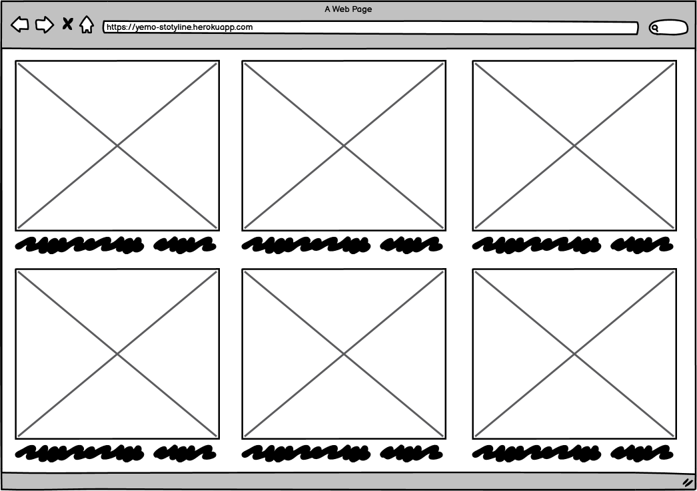

  - Blog/Site Page - 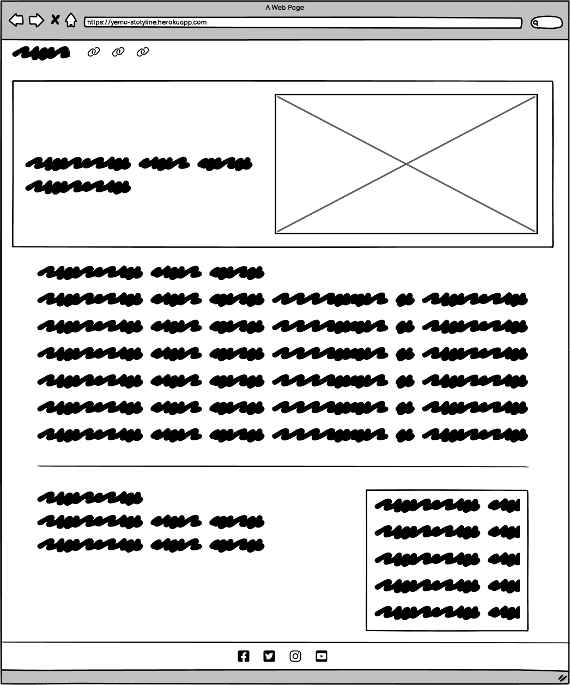

# Features

- ### Responsiveness

The application is designed to be fully responsive on all devices, thanks to the Bootstrap theme. It adapts seamlessly to different screen sizes, including mobile devices. In the mobile view, there is a collapsible hamburger icon that simplifies navigation. All images and post titles are appropriately resized to ensure optimal viewing experience across devices.

In mobile phone landscape mode all columns show beside one another, however, the nav header and footer don't reach from one end of the page to the other.

- ### Future Enhancements

- User ability to perform CRUD functionalty from the FrontEnd.

- Expanded Login Authentication: In the future, I plan to incorporate additional login authentication options for users who don't have a Google account. This will provide more flexibility and convenience by offering alternative login methods

# Technologies Used

### Languages Used

- [HTML5](https://developer.mozilla.org/en-US/docs/Glossary/HTML5)
- [CSS3](https://developer.mozilla.org/en-US/docs/Web/CSS)
- [Python](https://www.python.org)

### Frameworks, Libraries and Programs Utilized

1. [Django:](https://www.djangoproject.com/)
   - The website structure, functionalities, data model, and database were implemented using the Python-based Django framework.
1. [Bootstrap 5.2.3:](https://startbootstrap.com/theme/business-casual)
   - Bootstrap was leveraged to ensure responsiveness and enhance the overall styling of the website. The Business Casual theme was employed.
1. [Google Fonts:](https://fonts.google.com/)
   - Lato and Tangerine were chosen as the fonts for the site logo, while Segoe was utilized as the main font for labels, titles, and body text.
1. [Font Awesome:](https://fontawesome.com/)
   - Font Awesome icons were incorporated throughout the website to enhance aesthetics and improve the user experience.
1. [jQuery:](https://jquery.com/)
   - jQuery, included with Bootstrap, was used to make the navigation bar responsive and enable smooth scrolling functionality. It was also utilized for the Bootstrap Tempus Dominus datetime picker.
1. [Javascript:](https://en.wikipedia.org/wiki/JavaScript)
   - JavaScript was employed to define the visibility duration of popup messages indicating successful completion of various form-related activities.
1. [Git:](https://git-scm.com/)
   - Git version control was utilized, with the Gitpod terminal being used for committing changes and pushing them to GitHub.
1. [GitHub:](https://github.com/)
   - GitHub served as the repository for storing the project's code after it was pushed from Git.
1. [Balsamiq:](https://balsamiq.com/)
   - Balsamiq was employed during the design phase to create wireframes for the website. [Wireframe1](yemos/screenshots/wireframe_home_page.png) [Wireframe2](yemos/screenshots/wireframe_article_page.png)
1. [Postgres database:](https://www.postgresql.org/)
   - Postgres was chosen as the database system for the project.
1. [Cloudinary:](https://cloudinary.com/)
   - Cloudinary was used for cloud-based storage and partly for linking website images.
1. [Heroku:](https://www.heroku.com/)
   - Heroku was utilized for deployment, hosting the application in the cloud.

# Testing

To ensure the quality and correctness of the project, the following testing procedures were implemented:

- The W3C Markup Validator and W3C CSS Validator Services were utilized to validate each page for HTML and CSS, respectively. This helped identify any syntax errors and ensure compliance with web standards.
- The Python files were validated using the built-in pylint compiler, which helped maintain code quality and adherence to coding standards.

These testing measures were crucial in identifying and resolving any issues or errors, ensuring a seamless and error-free user experience on the website.

- ### Unfixed Bugs [W3C URI Validator](https://validator.w3.org/#validate_by_uri)

  - See the result 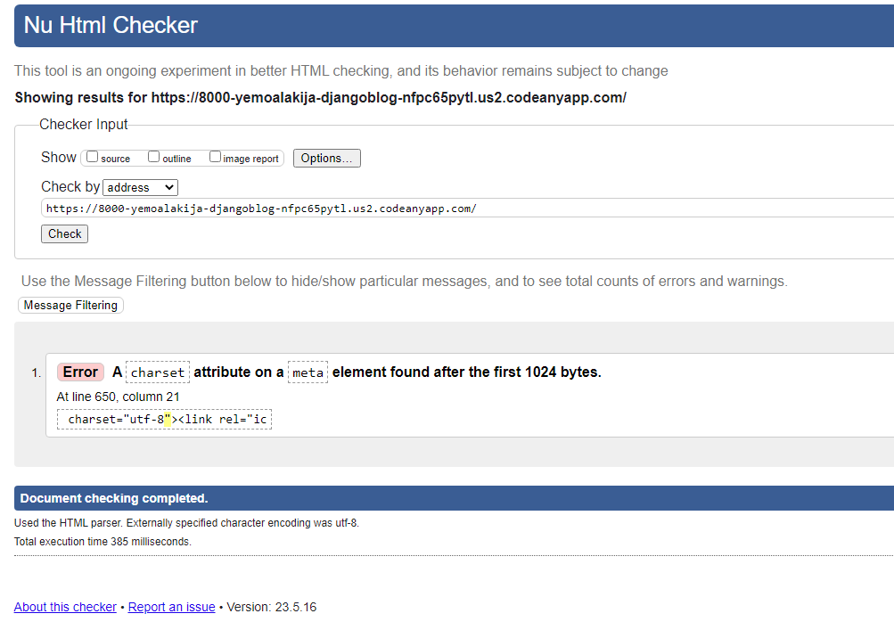

- [W3C CSS Validator](https://jigsaw.w3.org/css-validator/validator?uri=https%3A%2F%2Fyemoalakija-djangoblog-em4n9vy7a1.us2.codeanyapp.com%2F%23%2Fworkspaces%2FDjangoBlog&profile=css3svg&usermedium=all&warning=1&vextwarning=&lang=en)
  - See the 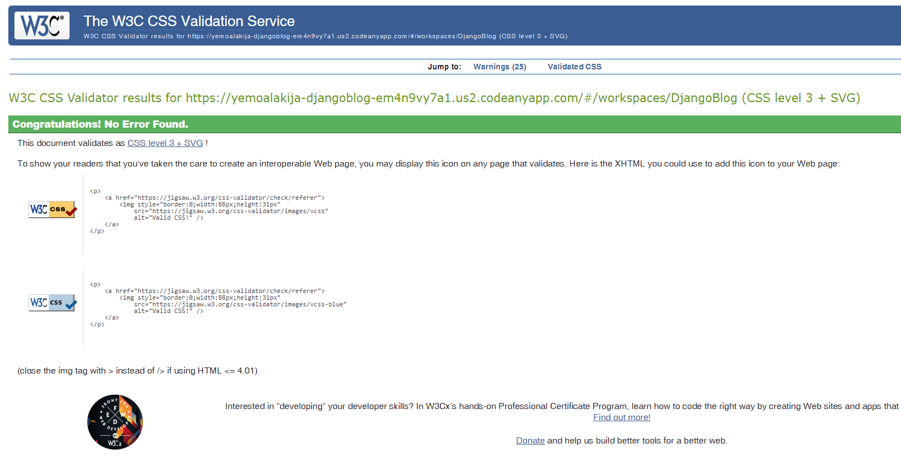
- [Pylint](https://pylint.org/)

  - See the pylint result 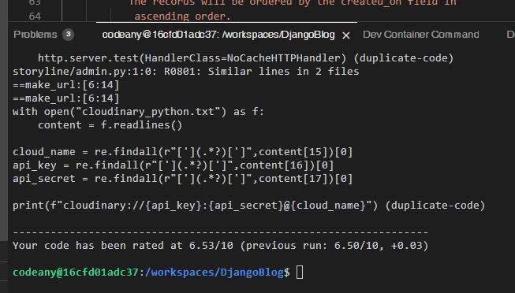

  - Lighthouse Test
    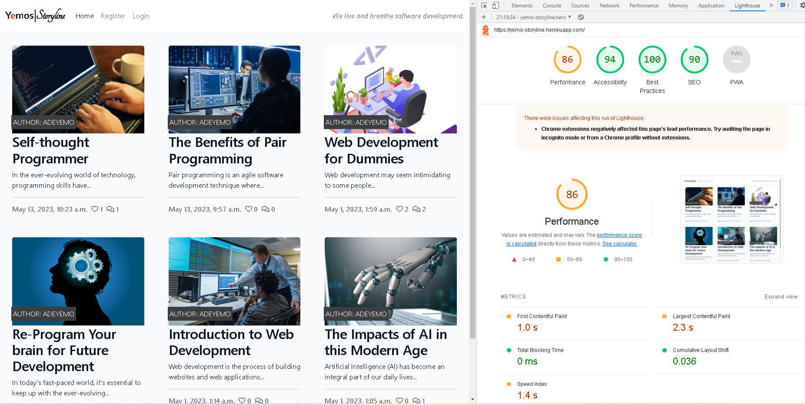

# Deployment

### Heroku

I started working on the project in Gitpod and I was able to carried out few tests deployment to make sure the site works as it should. Then, I later transferred the project to Codeanywhere due to Gitpod insufficient user hours.

The final deployemnt was carried out using codeanywhere, and GitHub connected to Heroku.

## Initial Deployment

- ### When creating a Django project, it is highly advisable to deploy early, due to the compexities of the development process and the actual application

So a text deployment was launch at the very early stage of the project to make sure that there's no any issues. And if there's issue, it can be easily tackled at early stage rather than waiting for the project to complete before deployment which would be cumbersome to debug.

# Credits

### Code

- The structure and code of the project were inspired by two project walkthroughs provided by Code Institute:

  - Hello Django - I utilized this walkthrough to implement CRUD functionalities in the project.
  - I think therefore I blog -
    - I expanded the messaging system to display an error message when a user submits an empty comment form.
    - I integrated the social apps feature of AllAuth to enable single sign-on functionality using the Google authentication provider.
    - I implemented a method called `number_of_comments` to display the count of comments on the front page, along with the number of likes.
    - I combined my knowledge of the JavaScript fetch API with Django to modify the like functionality, enabling it to call the like URL in the background without reloading the page.

- [Bootstrap5 Template](https://startbootstrap.com/theme/business-casual): Bootstrap Theme used throughout the project to style pages and make site responsive.

- [Official Django Documentation](https://docs.djangoproject.com/en/3.2/) was researched for syntax, code expressions, code functionalities and allauth implementation.

- Google AllOAuth(2.0)

- Stack Overflow was a valuable resource for researching syntax, code expressions, code functionalities, and problem-solving during the development process.

You can make this repository your own by:

```bash
git clone https://github.com/yemoalakija/DjangoBlog
```

then

```bash
pip install -r requirements.txt
```

Note: register with `cloudinary` to use their service and `postgres` for database. And also you'll have to generate a `django secret key` to run the site.

### Post Contents and Images

- Contents came from my personal research thorugh the use of google.
- As well ts the Post images.

### Acknowledgements

I would like to express my sincere gratitude to Code Institute for providing me with the invaluable opportunity to learn and grow in the field of Software Development. Their comprehensive curriculum and supportive learning environment have been instrumental in my journey.

I would also like to extend a special thank you to Matt Rudge, whose calm and insightful teaching during the django project has been truly remarkable. His guidance, expertise, and dedication have significantly contributed to my understanding and proficiency in Django. I am incredibly grateful for his mentorship throughout this learning experience.
